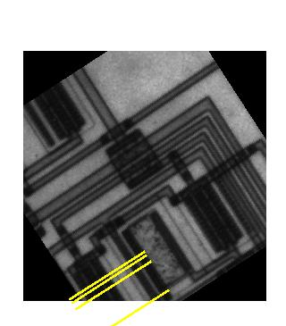

# Image Processing Algorithm implementations

### Nearest Neighbor, Bilinear, Bicubic Interpolation

Implementations of first exercise were based on inverse interpolation as was discussed in class. This included creating new empty images, iterating through all values, mapping these values back to original image and depending on the interpolation technique either remap value for Nearest-Neighbors, compute weighted average for Bilinear or compute weighted average of 16 neighbors for Bicubic interpolations.
One point worth noting in this exercise was implementation of weighted averaging based on distance of the pixels. This included simply having a list of weights which was then multiplied by the intensity of the pixel and summed up. Afterwards, everything was divided by total weight to normalize the images. Weights for neighbors were found by test and trial and can be simply modified. They were chosen in a way to replicate gaussian distribution. Nevertheless the results are very satisfactory and are shown in Fig. 1. As it can be seen, the original zoomed image shown by MATLAB imshow is using the NN interpolation for zooming images. Furthermore, it can be observed that bilinear shows smoother image, but bicubic is even smoother for diagonal lines and shows best smoothing.

Fig. 1. Various interpolation techniques shown on image zoomed two times. 

### Distance Transform and Skeletonization

As the implementation of the third task was based on the second, it was decided to merge them into one MATLAB script. Aim of the second task was to implement the Distance Transform which aims to find image representation based on pixel distances from the corners. Implementation was based on first computing the corner pixels and counting the total number of foreground pixels. Afterwards, the task was finding 8-neighbors of border pixels and incrementing the value. As the values of all foreground pixels became non-zero, the loop terminated. Finally, the distance image was normalized with regard to maximum value being proportional to 256.

In the Skeletonization, as was mentioned in exercise, boundary pixels which had background pixels in their East and North OR West and North OR East and South OR West and South neighborhoods were marked as corner points. Afterwards, maximum pixel in their 8-neighborhood was marked and the process continued until convergence for each corner point. The results of both distance transform and skeletonization for rectangle with rounded corners shown in Fig. 1. and Facebook binary logo is shown in Fig. 2. As it can be seen, skeletonization algorithm is very sensitive to rounded corners because it finds corner pixels only locally for each pixel, therefore for rounded parts there are several paths from rounded parts to central “skeleton”.

Fig. 2. Distance transform and skeletonization algorithms used on rectangle with rounded corners 

Fig. 3. Distance transform and skeletonization algorithms used on Facebook logo 

### Custom filter mask on image

To apply an arbitrary mask on the image, variables that control padding level, original image iterations margins and convolution were introduced. Now, any odd sized filter can be applied on any image. As a result of applying the given mask of [1 2 3; 4 5 6; 7 8 10],  a smoothing effect was introduced as shown in Fig. 4. This is mainly because of the spread of weighting of pixels although not even was introduced. Although it was not stated in the exercise, the resulting value from the sum of products was divided by the sum of mask values to introduce normalization to the image after applying a mask.
Similar mask ([1 2 3 4 5; 6 7 8 9 10; 11 12 13 14 15; 16 17 18 19 20; 21 22 23 24 25])  of size 5x5 had an even more visible smoothing effect as shown in Fig. 5.

Fig. 4. Image after applying given 3x3 mask 

Fig. 5. Image after applying similar to given 5x5 mask 

### Sobel edge detector

In the second exercise, using the same convolution algorithm, Sobel edge detection algorithm was developed. The only difference with the original mask algorithm is that there is no need in normalization of the image, as this mask has a differentiation effect and therefore its values already sum to 0. As shown in Fig. 6 and 7, on the right top effect of horizontal sobel operator and on the bottom left effect of vertical sobel operator applied on image are shown. As a result on the bottom right, the final result of the Sobel edge detector is shown. It is computed as a square root of sum of squares of pixels of both vertically applied and horizontally applied filters and thresholding the values.

Fig. 6. Circuit image after applying Sobel edge detector. 

Fig. 7. Building image after applying Sobel edge detector. 

### Median filtering

Task of the third task was to apply a classical median filtering algorithm on the the RGB video to decrease the effect of noise. Usually, the median filter is applied to sharp and sudden disturbances and has a great effect of removing this kind of noise. However, as it was observed, the video that was given as an input does not share these properties of salt and pepper noise and it is rather finely distributed noise. As it is shown in figures below, almost none of the sizes of median filter is able to remove this noise. However,  mask bigger than 9x9 are smoothing the image overall therefore somehow reducing the noise, but a lot of valuable features are lost.

After several attempts, it was further decided that noise may be evenly distributed throughout the all the 3 red, blue and green layers of the image, and it was assumed that applying median filtering to all layers simultaneously and separately may help.

However, as it is shown above, it has the same effect as applying filter on the grayscale image.
Output videos using both grayscale, RGB filters of different sizes are in the folder.

### Hough Transform

In the last exercise, the task was to implement the Hough transform on the image. Firstly, the same technique was used to obtain the edge binary image of the input. 

Fig. 8. Input image after applying Sobel edge detector. 

Afterwards, two techniques were used to obtain the Hough space of the input image.
First one starts as finding all coordinates of non-zero values in x and y matrices from the edge detected image. Afterwards, simple trigonometric functions are applied on the values to transform these points to the Hough (rho, theta) space. The output is shown as the first image in Fig 6. As it can be clearly seen, although it is wider than the second, it shares the common properties and shape of the Hough space outputted by the MATLAB’s internal hough() function. 

On the other hand, Hough transform was created by using the gradients obtained by the Sobel operators. These values were used to generate and populate theta and amplitudes matrices. These thetas then were used to obtain value rho, to fill the Hough Space matrix. These values additionally were offseted and rounded to use them as indices which can only be positive integers. Although, Hough Transform obtained using gradients technique does not look as the previous two, it still shares common sinusoidal properties while still being a little dispersed. Additionally it also uses an amplitudes of the gradients as incrementers opposed to previous one, which should be a better indicator of lines crossings.

Fig. 9. Hough transforms using 3 different techniques.

Fig. 10. Thresholded edge lines obtained from classical Hough transform

Fig. 11. Thresholded edge lines obtained from gradients Hough transform 

### Digit Recognition algorithm
The aim of this homework assignment was to implement a Digit Recognition algorithm. 
During the completion of this homework, we have made multiple approaches to solving this problem, but all of them had their particular disadvantages. Our final implementation is different from the ones discussed in the lecture and is rather based on a novel technique which was inspired by the "Printed Numeral Recognition Using Structural and Skeleton Features."  work [1]. However, our methodology is different from the proposed ones in the paper and is based on the feature extraction and comparison based on the scaled widths of different image components. More details on the values is explained in the next section.

The complete pipeline of the final implementation is as follows:
    1. Getting any image as input and conversion into “logical” bitmap.
    2. Then Region of Interest is obtained from the image and cropped, where borders are one pixel away from critical/edge pixels
    3. The image is then resized to one common size using the Nearest-Neighbors Interpolation technique
    4. Then 7 different rows are selected where the maximum possible horizontal distance between black pixels is determined (width of the digit at certain “cross-section”)
    5. These distances are modified and scaled in a way to represent useful information about the digit in the image (features like vertical symmetry, relation of top width to bottom width, etc.)
    6. Finally, the digit in the image is classified based on a set of comparison values and features which were obtained from scratch, using mathematical analysis techniques.

The advantage of this implementation is that it is able to recognize classical numbers in any font size and even for having bold and italics styles. The testing was conducted on a set of generated digits which was kindly shared by Asset Malik. The test set consists of all digits from 0 to 9 in font ranging from 48 to 72 and which can have classical, bold or italics styles.

The results of digit recognition accuracies on a test in set are shown in Fig. 1. This accuracy statistics considered all 1000 testing samples. 
These tests can be additionally run the “Testing_Main.m” script in the main folder.

Fig. 12. Digit recognition accuracy on the testing set 

Our methodology of comparing the scaled values is as follows:

Firstly, we obtain maximum widths at different heights of the digit, that are chosen to “hit” the most valuable features on the majority of samples (Fig. 2). 

Fig. 13. Display of 7 cross-sections of digits for horizontal distance 

Then, the main features constitute to relations of these horizontal distances as follows:

 

 
Afterwards these values are compared to values that belong (in particular range) to some particular digit and the classification is done using the “modified decision tree” model based on features’ values below:

Fig. 14. Mean values of scaled distances sets for each digit 

[1] Reddy, R. Vijaya Kumar, and Uppu Ravi Babu. "Printed Numeral Recognition Using Structural and Skeleton Features." (2018).
